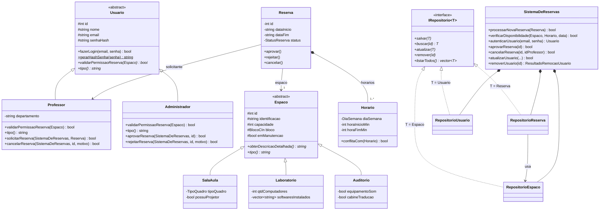
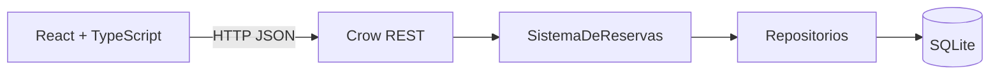

# Relatorio do Sistema de Reservas do CIn

## 1. Objetivo

O Sistema de Reservas do Centro de Informatica da UFPE permite consultar espacos, verificar
disponibilidade e solicitar reservas. Professores acompanham e cancelam as proprias solicitacoes;
administradores mantem o cadastro de espacos e decidem os pedidos.

## 2. Usuarios e funcionalidades

| Perfil | Funcionalidades |
| --- | --- |
| Visitante | Criar conta de professor e entrar no sistema. |
| Professor | Consultar espacos e disponibilidade, solicitar reservas recorrentes, consultar as proprias reservas e cancelar pedidos vigentes; editar ou remover a propria conta. |
| Administrador | Cadastrar, consultar, editar, colocar em manutencao e remover espacos; consultar reservas e aprovar ou rejeitar pedidos; consultar usuarios e remover contas de professores. |

Espacos e usuarios tem CRUD completo. Uma conta so pode ser removida se nao tiver reservas,
para preservar o historico; contas de administrador nao sao removidas pela API. Reservas seguem
um ciclo de vida, nao um CRUD generico: sao criadas pelo professor, consultadas por
professor/administrador, aprovadas ou rejeitadas pelo administrador e canceladas pelo professor.
A remocao fisica de reservas nao e exposta pela API.

## 3. Modelo de dominio

- `Usuario` encapsula identidade e autenticacao. `Professor` e `Administrador` especializam o tipo e as permissoes.
- `Espaco` e abstrato; `SalaAula`, `Laboratorio` e `Auditorio` fornecem atributos e comportamento especificos.
- `Reserva` associa professor, espaco, periodo, status, horarios semanais, motivo e data de criacao.
- `Horario` representa um intervalo de minutos em um dia da semana; enums centralizam tipos, blocos e status.

A secao 4 detalha como essas classes usam os conceitos de orientacao a objetos.

## 4. Conceitos de orientacao a objetos

Esta secao mostra onde cada conceito de POO aparece no backend em C++ e por que foi usado. Os
caminhos sao relativos a `backend/`.

### 4.1 Diagrama de classes



Legenda: `#` protegido, `-` privado, `+` publico, `*` no fim do metodo indica virtual puro e `$`
indica metodo estatico. `<|--` e heranca, `<|..` e implementacao de interface, `*--` e composicao
e `-->` e associacao.

### 4.2 Classes, objetos e encapsulamento

Cada conceito do dominio virou uma classe com estado privado e uma interface publica pequena.
`Reserva` (`include/models/Reserva.hpp`) guarda datas, status, solicitante, espaco e horarios
como `private`; o resto do sistema le por getters `const` e altera por metodos especificos
(`aprovar`, `rejeitar`, `cancelar`, `setMotivo`...), nunca mexendo direto nos atributos.

O encapsulamento tambem protege invariantes:

- `Horario` (`src/models/Horario.cpp`) valida no construtor que o intervalo cabe no dia e que o
  inicio vem antes do fim, lancando `std::invalid_argument` caso contrario. Como a classe nao tem
  setters, um horario criado com valores validos nao pode ser corrompido depois.
- `Usuario` nunca guarda nem devolve a senha em texto. O hash so e criado por
  `Usuario::gerarHashSenha` e conferido por `fazerLogin`, que usa PBKDF2 e comparacao em tempo
  constante. A API serializa o usuario sem o campo `senhaHash`.

### 4.3 Modificadores de acesso

| Modificador | Onde | Por que |
| --- | --- | --- |
| `private` | atributos de `Reserva`, `Horario`, `Professor::departamento`, atributos proprios das subclasses de `Espaco` | so a propria classe altera o estado |
| `protected` | atributos comuns de `Espaco` e `Usuario` | as subclasses acessam direto; o resto do codigo usa getters |
| `public` | construtores, getters e operacoes do dominio | e a interface que os outros objetos podem usar |

Os metodos auxiliares dos repositorios (`mapearLinha`, `listarHorarios`) e o estado interno do
`SistemaDeReservas` (mutex e cache de credenciais) tambem ficam `private`.

### 4.4 Heranca

Ha duas hierarquias de dominio, ambas com heranca publica ("e um"):

- `Espaco` -> `SalaAula`, `Laboratorio`, `Auditorio`. Cada subclasse acrescenta seus atributos
  (quadro e projetor, computadores e softwares, som e cabine de traducao) e repassa a parte comum
  ao construtor da base:

  ```cpp
  SalaAula::SalaAula(int id, std::string identificacao, /* ... */,
                     TipoQuadro tipoQuadro, bool possuiProjetor)
      : Espaco(id, std::move(identificacao), /* ... */),
        tipoQuadro(tipoQuadro), possuiProjetor(possuiProjetor) {}
  ```

- `Usuario` -> `Professor`, `Administrador`. `Professor` acrescenta `departamento` e as acoes de
  solicitar e cancelar; `Administrador` nao tem atributos proprios e herda os construtores da base
  com `using Usuario::Usuario;`.

Os tres repositorios herdam de `IRepositorio<T>` (secao 4.5).

### 4.5 Classes abstratas e interfaces

`Espaco` e `Usuario` sao abstratas: tem metodos virtuais puros (`= 0`), entao nao podem ser
instanciadas. So existem objetos das subclasses concretas.

```cpp
class Espaco {
public:
    virtual ~Espaco() = default;
    virtual std::string obterDescricaoDetalhada() const = 0;
    virtual std::string tipo() const = 0;
    // ...
};
```

`IRepositorio<T>` (`include/repositories/IRepositorio.hpp`) e uma interface pura: so tem o
destrutor virtual e as cinco operacoes de CRUD como virtuais puras. `RepositorioEspaco`,
`RepositorioReserva` e `RepositorioUsuario` a implementam, e por isso os tres oferecem o mesmo
contrato (`salvar`, `buscar`, `atualizar`, `remover`, `listarTodos`).

Os destrutores das bases sao `virtual`. Assim, quando o ultimo `shared_ptr<Espaco>` de um
`Laboratorio` e liberado, o destrutor de `Laboratorio` tambem roda e o vetor de softwares e
destruido corretamente.

### 4.6 Polimorfismo

**Polimorfismo dinamico (metodos virtuais).** O codigo trabalha com `shared_ptr<Espaco>` e
`shared_ptr<Usuario>`, e a implementacao executada depende do tipo real do objeto:

- `SistemaDeReservas::processarNovaReserva` chama
  `r->getSolicitante()->validarPermissaoReserva(*r->getEspaco())`. Um `Professor` so reserva
  espacos fora de manutencao; um `Administrador` pode reservar qualquer espaco. O servico nao
  testa o tipo: cada classe responde por si.
- A serializacao de espacos (`serializarEspaco` em `src/main.cpp`) chama
  `obterDescricaoDetalhada()` e `tipo()`; cada subclasse monta a propria descricao.
- `RepositorioEspaco::salvar` e `RepositorioUsuario::salvar` gravam a coluna `tipo` com o valor de
  `obj->tipo()`, sem precisar saber qual subclasse recebeu.

Todas as redefinicoes usam `override`, entao o compilador acusa erro se a assinatura nao
corresponder a de um metodo virtual da base.

**Identificacao do tipo em tempo de execucao.** Quando e preciso acessar atributos que so existem
numa subclasse, o codigo usa `std::dynamic_pointer_cast`, que devolve `nullptr` se o objeto nao
for daquele tipo. Exemplos: gravar `departamento` so para professores, serializar os campos de
`Laboratorio` e restringir rotas ao perfil (`dynamic_pointer_cast<Administrador>(usuario)`).

**Polimorfismo estatico.**

- Sobrecarga de funcoes: `toString` tem uma versao para cada enum (`BlocoCIn`, `TipoMobilia`,
  `TipoQuadro`, `DiaSemana`, `StatusReserva`) e o compilador escolhe pelo tipo do argumento.
- Templates: `IRepositorio<T>` e um unico molde instanciado para `Espaco`, `Reserva` e `Usuario`.
- Argumentos padrao, como em `cancelarReserva(int idReserva, const std::string& motivo = "")`.

### 4.7 Ponteiros e referencias

| Recurso | Onde | Por que |
| --- | --- | --- |
| `std::shared_ptr` | entidades devolvidas pelos repositorios; `Reserva::solicitante` e `Reserva::espaco` | posse compartilhada: a mesma entidade pode estar em uma reserva e numa lista ao mesmo tempo, e e liberada quando ninguem mais a usa |
| ponteiro cru nao proprietario | `sqlite3* db` nos repositorios; `RepositorioEspaco*` dentro de `RepositorioReserva` | o objeto apontado pertence a outro (o `main` fecha a conexao; o `SistemaDeReservas` e dono dos repositorios) |
| ponteiro opcional | `std::vector<ConflitoReserva>* conflitos = nullptr` em `processarNovaReserva` | quem passa um vetor recebe a lista de conflitos; quem passa `nullptr` nao paga por ela |
| referencia | `const Espaco&` em `validarPermissaoReserva`; `SistemaDeReservas&` em `Professor::solicitarReserva` | acesso sem copia e sem transferir posse; a referencia nunca e nula |
| referencia constante | getters como `const std::string& getNome() const` | devolve sem copiar e sem permitir alteracao |

Parametros recebidos por valor e movidos com `std::move` (por exemplo, no construtor de
`Reserva`) evitam copias quando quem chama passa um objeto temporario.

### 4.8 Composicao e associacao

- **Composicao:** `SistemaDeReservas` tem os tres repositorios como membros; eles nascem e morrem
  com o sistema. `Reserva` tem um `std::vector<Horario>`; os horarios so existem dentro da reserva.
- **Associacao:** `Reserva` aponta para um `Professor` e um `Espaco`, que existem por conta
  propria. Por isso o vinculo e um `shared_ptr`, e nao uma copia do objeto.
- **Dependencia:** `RepositorioReserva` usa o `RepositorioEspaco` para reconstruir o espaco de cada
  reserva lida do banco.

### 4.9 Padroes de projeto

- **Repository:** `IRepositorio<T>` e suas tres implementacoes isolam o SQL. Modelos e servico nao
  conhecem `sqlite3`; trocar o banco afetaria so os repositorios.
- **Facade:** `SistemaDeReservas` e a porta de entrada das regras de negocio. As rotas pedem
  operacoes como `processarNovaReserva` ou `removerUsuario` sem coordenar os repositorios.
- **Factory (metodo fabrica):** `RepositorioEspaco::mapearLinha` le a coluna `tipo` e cria
  `SalaAula`, `Laboratorio` ou `Auditorio`, devolvendo sempre `shared_ptr<Espaco>`.
  `RepositorioUsuario::mapearLinha` faz o mesmo para `Professor` e `Administrador`, e
  `construirEspaco` (em `src/main.cpp`) para o JSON recebido pela API.
- **RAII:** `travarBanco()` devolve um `std::unique_lock`; a trava e liberada automaticamente no
  fim do escopo da rota, mesmo se uma excecao for lancada.

### 4.10 Enumeracoes e excecoes

- `enum class` (`BlocoCIn`, `StatusReserva`, `DiaSemana`, `ResultadoRemocaoUsuario`...) evita
  numeros e textos soltos e impede misturar valores de enums diferentes.
- Erros de validacao lancam `std::invalid_argument`, e falhas do banco lancam
  `std::runtime_error`. As rotas capturam cada tipo e o convertem no codigo HTTP correspondente
  (400 ou 500), sem espalhar testes de erro por todo o codigo.

## 5. Arquitetura e persistencia



O frontend e uma aplicacao React/Vite com rotas para login, cadastro, disponibilidade, reservas,
solicitacoes administrativas, catalogo e gestao de espacos. Em desenvolvimento, o Vite encaminha
`/api` para o backend Crow em `127.0.0.1:18080`.

No backend, `SistemaDeReservas` concentra regras de negocio e os repositorios fazem consultas
SQLite com prepared statements. O padrao Repository separa persistencia das entidades e do servico.
As tabelas principais sao `usuarios`, `espacos`, `reservas` e `reserva_horarios`.

## 6. Regras de negocio

- Reservas pendentes e aprovadas ocupam horarios; rejeitadas e canceladas liberam o espaco.
- Intervalos sao semiabertos: reservas encostadas, como 10h-12h e 12h-13h, nao conflitam.
- Pedidos recorrentes validam cada dia solicitado no periodo e retornam as datas/faixas conflitantes.
- Espacos em manutencao nao aparecem na disponibilidade nem aceitam novos pedidos.
- So administradores decidem solicitacoes pendentes; professores so cancelam as proprias reservas vigentes.
- Identificacao de espaco e unica, o tipo nao muda depois do cadastro e espacos com reservas nao podem ser removidos.
- Agenda nao revela o professor para outros professores; administradores podem ve-lo.

## 7. Interface grafica

A interface e o cliente principal do sistema, nao apenas um prototipo. Ela oferece estados de
carregamento/erro/vazio, validacao de formularios, confirmacao para decisoes administrativas,
filtros e navegacao por perfil. A identidade visual do CIn e documentada em
[`frontend/docs/identidade-cin-ufpe.md`](frontend/docs/identidade-cin-ufpe.md), e a pagina
`/style-guide` fica disponivel em desenvolvimento.

## 8. Execucao e verificacao

O backend requer CMake, C++17, SQLite, OpenSSL e Crow. No Windows, a configuracao MinGW/vcpkg e
descrita no [README](README.md). O frontend requer Node 20.19+ ou 22.12+.

```powershell
cmake --build backend/build-mingw
Push-Location backend/build-mingw
& .\sistema_reservas.exe
```

Em outro terminal, rode `npm install` e `npm run dev` dentro de `frontend/`. A API real e o padrao;
`VITE_API_SIMULADA=todos` habilita os dados de demonstracao no navegador.

Verificacoes disponiveis: `npm test`, `npm run build`, `npm run lint` e
`backend/tests/run_model_smoke.ps1`. Os testes automatizados atuais cobrem regras do frontend e
modelos C++; ainda falta uma suite persistente de integracao HTTP/SQLite.

## 9. Limites e cuidados

Quando a tabela de espacos esta vazia, o backend importa 77 espacos reservaveis do catalogo CIn.
Identificacao, tipo e bloco sao do catalogo, mas capacidade, equipamentos e acessibilidade sao
defaults demonstrativos porque esses dados nao estao na fonte. Eles precisam ser revisados antes
de usar a base como cadastro oficial.

Senhas sao armazenadas com PBKDF2. O cliente usa HTTP Basic com credenciais mantidas em memoria;
fora de ambiente local, publique o backend somente atras de HTTPS. A criacao inicial do
administrador exige `CIN_ADMIN_EMAIL` e `CIN_ADMIN_SENHA`, sem credencial fixa no codigo.