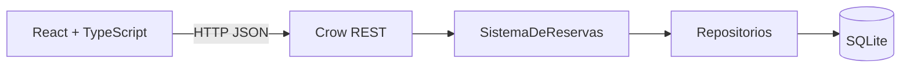

# Relatorio do Sistema de Reservas do CIn

## 1. Objetivo

O Sistema de Reservas do Centro de Informatica da UFPE permite consultar espacos, verificar
disponibilidade e solicitar reservas. Professores acompanham e cancelam as proprias solicitacoes;
administradores mantem o cadastro de espacos e decidem os pedidos.

## 2. Usuarios e funcionalidades

| Perfil | Funcionalidades |
| --- | --- |
| Visitante | Criar conta de professor e entrar no sistema. |
| Professor | Consultar espacos e disponibilidade, solicitar reservas recorrentes, consultar as proprias reservas e cancelar pedidos vigentes; editar ou remover a propria conta. |
| Administrador | Cadastrar, consultar, editar, colocar em manutencao e remover espacos; consultar reservas e aprovar ou rejeitar pedidos; consultar usuarios e remover contas de professores. |

Espacos e usuarios tem CRUD completo. Uma conta so pode ser removida se nao tiver reservas,
para preservar o historico; contas de administrador nao sao removidas pela API. Reservas seguem um ciclo de vida, nao um CRUD generico: sao
criadas pelo professor, consultadas por professor/administrador, aprovadas ou rejeitadas pelo
administrador e canceladas pelo professor. A remocao fisica de reservas nao e exposta pela API.

## 3. Modelo de dominio

- `Usuario` encapsula identidade e autenticacao. `Professor` e `Administrador` especializam o tipo e as permissoes.
- `Espaco` e abstrato; `SalaAula`, `Laboratorio` e `Auditorio` fornecem atributos e comportamento especificos.
- `Reserva` associa professor, espaco, periodo, status, horarios semanais, motivo e data de criacao.
- `Horario` representa um intervalo de minutos em um dia da semana; enums centralizam tipos, blocos e status.

O encapsulamento protege o estado das entidades; heranca e polimorfismo permitem tratar tipos
concretos por interfaces comuns. O backend usa `std::shared_ptr` nas relacoes entre entidades e
referencias para dependencias nao proprietarias, como a conexao SQLite recebida pelos repositorios.

## 4. Arquitetura e persistencia



O frontend e uma aplicacao React/Vite com rotas para login, cadastro, disponibilidade, reservas,
solicitacoes administrativas, catalogo e gestao de espacos. Em desenvolvimento, o Vite encaminha
`/api` para o backend Crow em `127.0.0.1:18080`.

No backend, `SistemaDeReservas` concentra regras de negocio e os repositorios fazem consultas
SQLite com prepared statements. O padrao Repository separa persistencia das entidades e do servico.
As tabelas principais sao `usuarios`, `espacos`, `reservas` e `reserva_horarios`.

## 5. Regras de negocio

- Reservas pendentes e aprovadas ocupam horarios; rejeitadas e canceladas liberam o espaco.
- Intervalos sao semiabertos: reservas encostadas, como 10h-12h e 12h-13h, nao conflitam.
- Pedidos recorrentes validam cada dia solicitado no periodo e retornam as datas/faixas conflitantes.
- Espacos em manutencao nao aparecem na disponibilidade nem aceitam novos pedidos.
- So administradores decidem solicitacoes pendentes; professores so cancelam as proprias reservas vigentes.
- Identificacao de espaco e unica, o tipo nao muda depois do cadastro e espacos com reservas nao podem ser removidos.
- Agenda nao revela o professor para outros professores; administradores podem ve-lo.

## 6. Interface grafica

A interface e o cliente principal do sistema, nao apenas um prototipo. Ela oferece estados de
carregamento/erro/vazio, validacao de formularios, confirmacao para decisoes administrativas,
filtros e navegacao por perfil. A identidade visual do CIn e documentada em
[`frontend/docs/identidade-cin-ufpe.md`](frontend/docs/identidade-cin-ufpe.md), e a pagina
`/style-guide` fica disponivel em desenvolvimento.

## 7. Execucao e verificacao

O backend requer CMake, C++17, SQLite, OpenSSL e Crow. No Windows, a configuracao MinGW/vcpkg e
descrita no [README](README.md). O frontend requer Node 20.19+ ou 22.12+.

```powershell
cmake --build backend/build-mingw
Push-Location backend/build-mingw
& .\sistema_reservas.exe
```

Em outro terminal, rode `npm install` e `npm run dev` dentro de `frontend/`. A API real e o padrao;
`VITE_API_SIMULADA=todos` habilita os dados de demonstracao no navegador.

Verificacoes disponiveis: `npm test`, `npm run build`, `npm run lint` e
`backend/tests/run_model_smoke.ps1`. Os testes automatizados atuais cobrem regras do frontend e
modelos C++; ainda falta uma suite persistente de integracao HTTP/SQLite.

## 8. Limites e cuidados

Quando a tabela de espacos esta vazia, o backend importa 77 espacos reservaveis do catalogo CIn.
Identificacao, tipo e bloco sao do catalogo, mas capacidade, equipamentos e acessibilidade sao
defaults demonstrativos porque esses dados nao estao na fonte. Eles precisam ser revisados antes
de usar a base como cadastro oficial.

Senhas sao armazenadas com PBKDF2. O cliente usa HTTP Basic com credenciais mantidas em memoria;
fora de ambiente local, publique o backend somente atras de HTTPS. A criacao inicial do
administrador exige `CIN_ADMIN_EMAIL` e `CIN_ADMIN_SENHA`, sem credencial fixa no codigo.